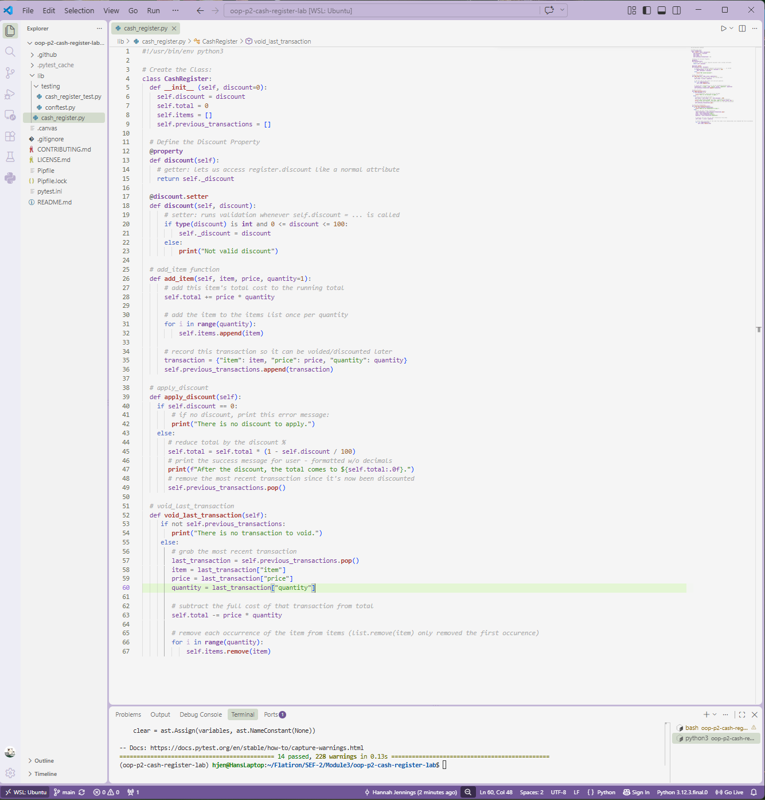

# Cash Register Lab

A Python `CashRegister` class built to practice object-oriented design — including custom properties with validation, and methods that manage state across a running total, an items list, and a transaction history.



## What This Lab Covers

This lab simulates a simple cash register for an e-commerce checkout. The `CashRegister` class supports:

- **Adding items** to the register, with an optional quantity
- **Applying a discount** to the total, as a percentage
- **Voiding the last transaction**, correctly reversing its effect on the total and items list

## Class Design

**Attributes**
- `discount` — a percentage (0–100) taken off the total. Defaults to `0` if not provided.
- `total` — running dollar total of the register.
- `items` — list of item names added so far (repeated once per quantity).
- `previous_transactions` — history of transactions, so the most recent one can be discounted or voided.

**Methods**
- `add_item(item, price, quantity=1)` — adds the item's cost to `total`, appends the item to `items`, and logs the transaction.
- `apply_discount()` — reduces `total` by the register's discount percentage. Prints an error if no discount is set.
- `void_last_transaction()` — removes the most recent transaction, subtracting its cost from `total` and removing its item(s) from `items`. Prints an error if there's nothing to void.

## Key Implementation Detail: The `discount` Property

`discount` is implemented as a Python property (`@property` / `@discount.setter`) rather than a plain attribute. This means every time `discount` is set — including during `__init__` — it's automatically validated:

```python
@discount.setter
def discount(self, discount):
    if type(discount) is int and 0 <= discount <= 100:
        self._discount = discount
    else:
        print("Not valid discount")
```

## Usage Example

```python
from cash_register import CashRegister

register = CashRegister(discount=20)
register.add_item("macbook air", 1000)
register.apply_discount()
# After the discount, the total comes to $800.
```

## Testing

This project is tested with `pytest`. All 14 tests pass, covering initialization, the discount property, `add_item` (including multiple items and quantities), `apply_discount` (including the no-discount case), and `void_last_transaction` (including multi-quantity voids).

Run the test suite with:

```
pytest
```

## Installation

1. Clone this repository.
2. Install dependencies: `pipenv install`
3. Activate the environment: `pipenv shell`